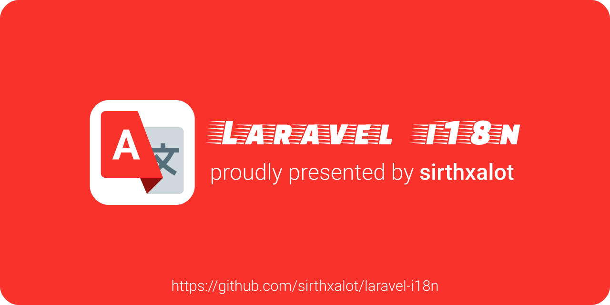

Introduction
--------------------------------------------------------------------------------

Take your Laravel application to a new level by supporting a 
worldwide audience on multiple translation drivers. This package 
is jam-packed with features to help people rapidly build professional 
web applications that can be adapted to various languages and regions 
without engineering changes.

Official Documentation
--------------------------------------------------------------------------------

Our [official documentation] is the perfect starting point, in
order to learn how to [install], setup or use Laravel I18n from 
scratch. Whether if you are a beginner or an advanced user does 
not matter, you will find what you need to know and become a 
master in no time.

Issue Tracking
--------------------------------------------------------------------------------

The [issue tracker] is meant in order to report bugs, request 
features or submitting a pull request. But please respect the 
following restrictions:

- Please **do not** report any security vulnerabilities (read [our security policy]).

- Please **do not** derail or troll issues. Keep the discussion on topic and
  respect the opinions of others.

- Please **do not** use the issue tracker for personal support requests
  (use our [discussion forum]).

- Please **do not** open issues or pull requests regarding third party code
  e.g. Laravel (open them in their respective repositories).

Contributing
--------------------------------------------------------------------------------

Want to get involved? Thanks! We're actively looking for folks
interested in helping out and there are plenty of ways you can help!
But, in order to be a part of our community you must follow and respect
our [code of conduct] and [contribution guideline].

License
--------------------------------------------------------------------------------

This open-sourced software is licensed under [the MIT license].

<!--                            that's all folks!                            -->

[sirthxalot]:                             https://github.com/sirthxalot
[official documentation]:                 https://sirthxalot.github.io/laravel-i18n
[install]:                                https://sirthxalot.github.io/laravel-i18n/v/1.x/guide/start/install/
[issue tracker]:                          https://github.com/sirthxalot/laravel-i18n/issues
[discussion forum]:                       https://github.com/sirthxalot/laravel-i18n/discussions

[our security policy]:                    ./.github/SECURITY.md
[the mit license]:                        ./LICENSE.md
[code of conduct]:                        ./.github/CODE_OF_CONDUCT.md
[contribution guideline]:                 ./.github/CONTRIBUTING.md
